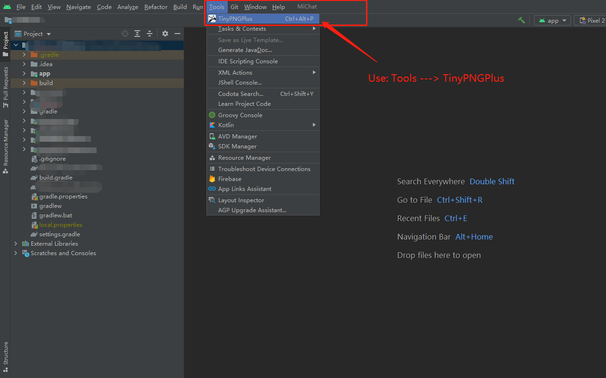

# TinyPngPluginPlus

利用 TinyPNG 的 API ，开发的图片压缩工具。

<b>Get TinyPNG  Apikey?</b><b><a href="https://tinypng.com/developers"> Click It</a></b>

<b><a href="https://github.com/mtjsoft/TinyPngPluginPlus/blob/master/TinyPngPluginPlus.zip">DownLoad Plugin</a></b>

<b>Use： Tools --> TinyPNGPlugin </b>

<b>keyboard-shortcut： Ctrl + Alt + P </b>

### 版本

<h4>v1.0.0 2022/03/28</h4>
<ul>
<li>实现对指定文件夹下的图片进行可视化压缩</li>
</ul>

### 示例

